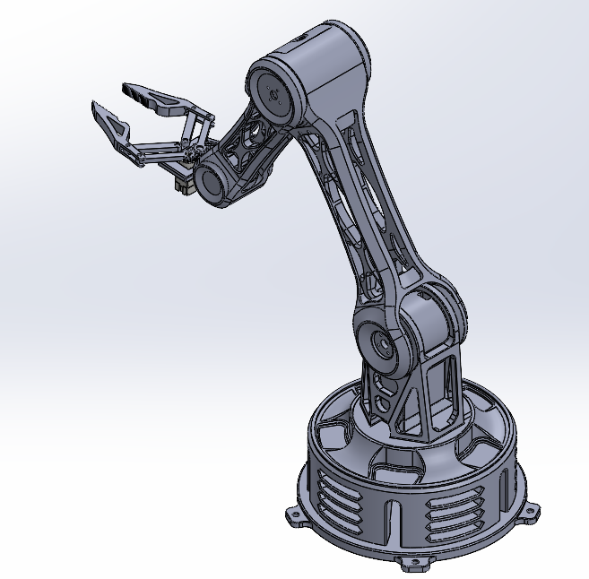
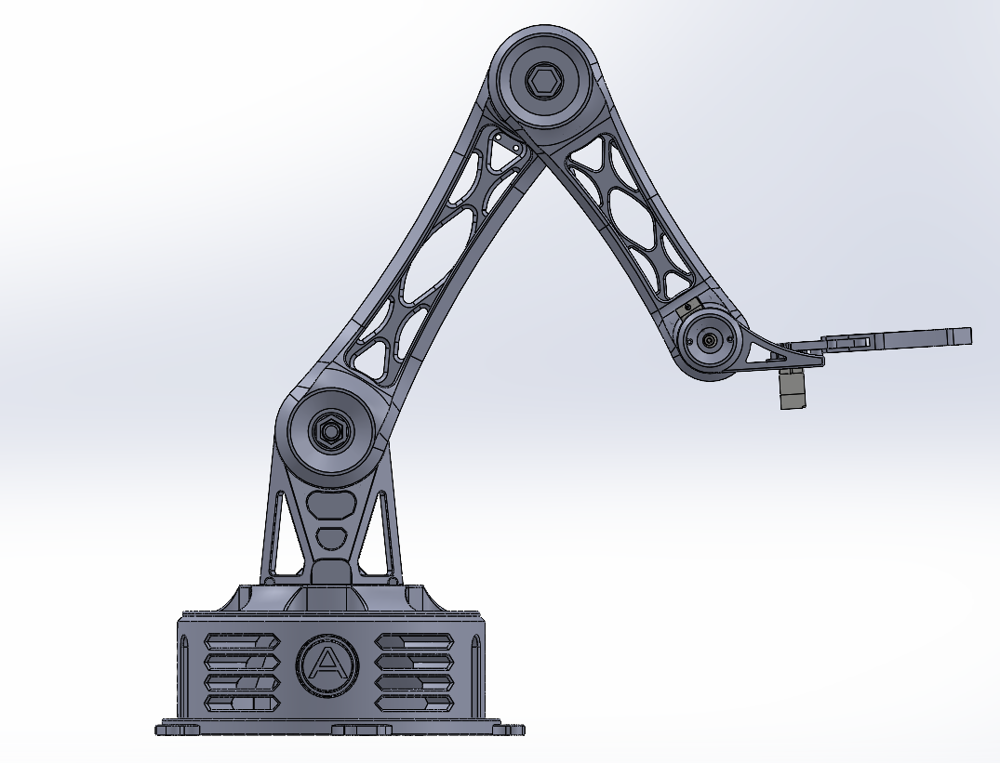
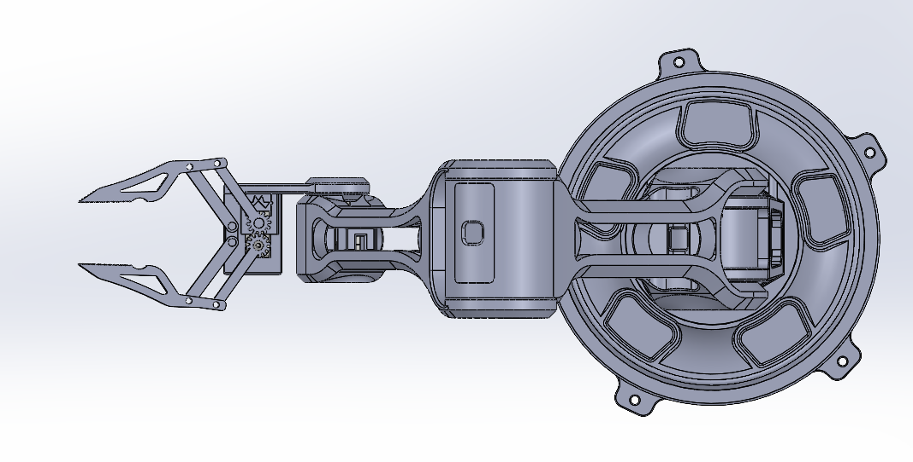
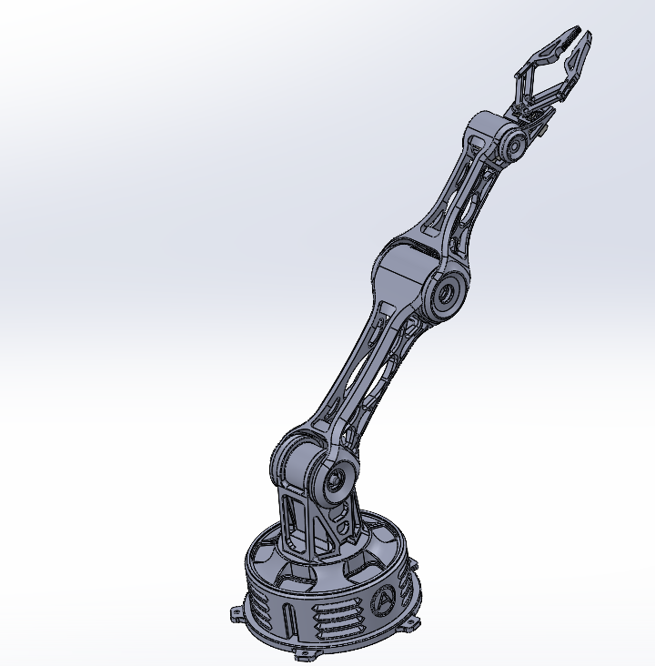

# Atlas V1 CAD

This folder contains the complete mechanical CAD design for **Project Atlas V1**, including the final assembly, reference components, and design resources used throughout development.

---

# Final Assembly

The current mechanical design is shown below.

## Isometric View



---

## Side View



---

## Top View



---

## Folded Configuration



---

# Mechanical Specifications

| Component | Description |
|------------|-------------|
| Degrees of Freedom | 5 DOF |
| Base Servo | MG995 |
| Shoulder Servo | MG995 |
| Elbow Servo | MG995 |
| Wrist Servo | MG90S |
| Gripper Servo | MG90S |
| CAD Software | SolidWorks |
| Manufacturing | FDM 3D Printing |

---

# Design Features

- Lightweight ribbed arm links
- Modular servo housings
- Split-print construction
- Internal cable routing
- Collision-checked assembly
- Heat-set insert mounting
- Serviceable servo covers
- Modular gripper assembly

---

# Folder Contents

```
CAD/
│
├── Final-Assembly/
│
├── Reference_Components/
│
├── MG90S_Dimensions.md
│
└── README.md
```

---


- Elbow
- Wrist
- Gripper
