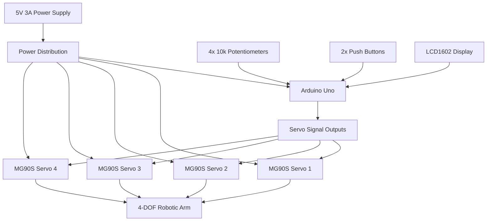
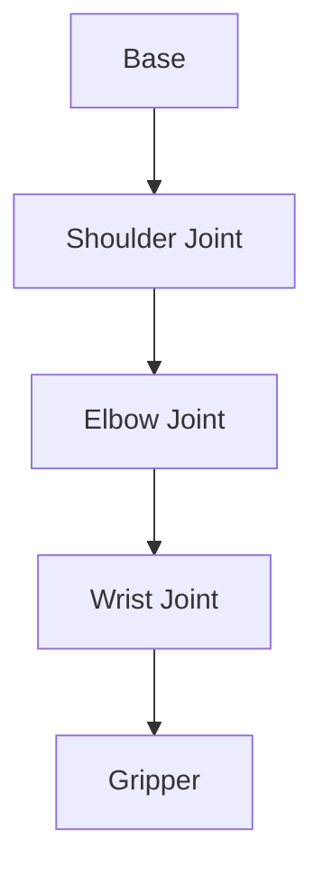
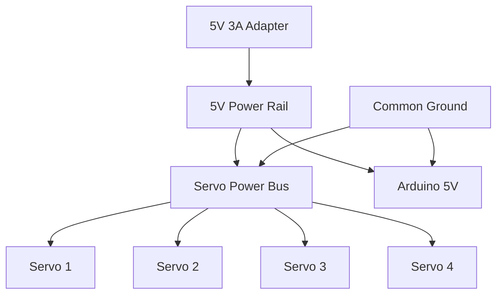
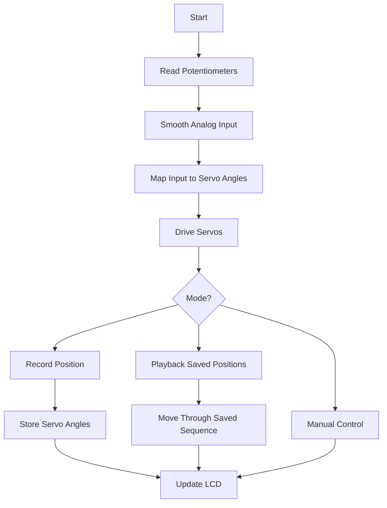

# System Architecture

## Overview

Project Atlas is a modular 4-degree-of-freedom desktop robotic manipulator designed around affordability, modularity, and ease of manufacturing. The system combines mechanical design, embedded control, servo actuation, manual input, motion recording, and 3D-printed structure.

---

## Overall System Diagram



---

## Mechanical Architecture



| Subsystem | Purpose |
|---|---|
| Base | Supports the robot and houses electronics |
| Shoulder Joint | Primary lifting joint |
| Elbow Joint | Extends and retracts the arm |
| Wrist Joint | Adjusts end-effector orientation |
| Gripper | Grasps objects |
| Controller Panel | Holds potentiometers, buttons, and LCD |

---

## Electrical Architecture

| Component | Role |
|---|---|
| Arduino Uno | Main development controller |
| MG90S Servos | Joint actuation |
| 10k Potentiometers | Manual joint input |
| Push Buttons | Save/playback control |
| LCD1602 | User feedback |
| 5V 3A Power Supply | External power source |
| Perfboard | Final electronics platform |

---

## Power Architecture



### Power Design Notes

- Servos are powered directly from the external 5V supply.
- Arduino and servo power must share a common ground.
- USB power is used only during development.
- The Arduino should not power all servos through its onboard 5V regulator.
- A large capacitor will be placed across the servo power rail to reduce voltage dips.

---

## Firmware Architecture



---

## Firmware Modes

| Mode | Function |
|---|---|
| Manual | Potentiometers directly control each servo |
| Record | Saves the current arm position |
| Playback | Replays saved motion positions |
| Pause | Stops playback while retaining saved positions |

---

## User Interface

| Component | Function |
|---|---|
| Potentiometer 1 | Base or shoulder control |
| Potentiometer 2 | Shoulder or elbow control |
| Potentiometer 3 | Wrist control |
| Potentiometer 4 | Gripper control |
| Button 1 | Save position |
| Button 2 | Play/pause sequence |
| LCD1602 | Displays mode, saved count, and status |

Example display:

```text
Mode: Manual
Saved: 03
```

---

## Development Versions

| Version | Description |
|---|---|
| V0.1 | Single-servo breadboard proof of concept |
| V0.2 | Four-servo breadboard prototype |
| V0.3 | Perfboard electronics and LCD integration |
| V1.0 | Complete 3D-printed robotic arm |
| V2.0 | Future upgrades such as custom PCB or inverse kinematics |

---

## System Summary

| Category | Selection |
|---|---|
| Degrees of Freedom | 4 |
| Controller | Arduino Uno |
| Future Controller | Arduino Nano |
| Actuators | MG90S Metal Gear Servos |
| Manual Control | 10k Potentiometers |
| User Interface | LCD1602 + Push Buttons |
| Manufacturing | FDM 3D Printing |
| CAD Software | SolidWorks |
| Programming | Arduino IDE / C++ |
| Power | 5V 3A External Supply |
