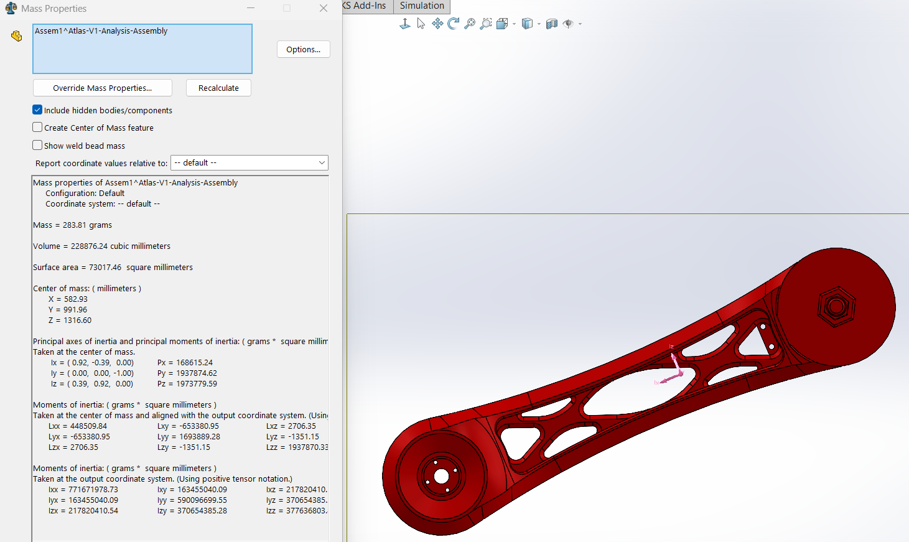

# Atlas V1 Mass Inventory

The following table records the theoretical CAD mass properties of the major Atlas V1 assemblies.

These values are extracted directly from SolidWorks using the verified Anycubic PLA material.

| Component | Mass (g) | Volume (mm³) | COM X (mm) | COM Y (mm) | COM Z (mm) | Status |
|---|---:|---:|---:|---:|---:|:---:|
| Base Housing (printed) |  |  |  |  |  | ☐ |
| Shoulder Printed Structure |  |  |  |  |  | ☐ |
| Link 1 Printed Structure | 283.81 | 228876.24 | 582.93 | 991.96 | 1316.60 | ✅ |
| Elbow MG995 Servo |  |  |  |  |  | ☐ |
| Link 2 Printed Structure |  |  |  |  |  | ☐ |

## Supporting Figures

### Link 1 Printed Structure

