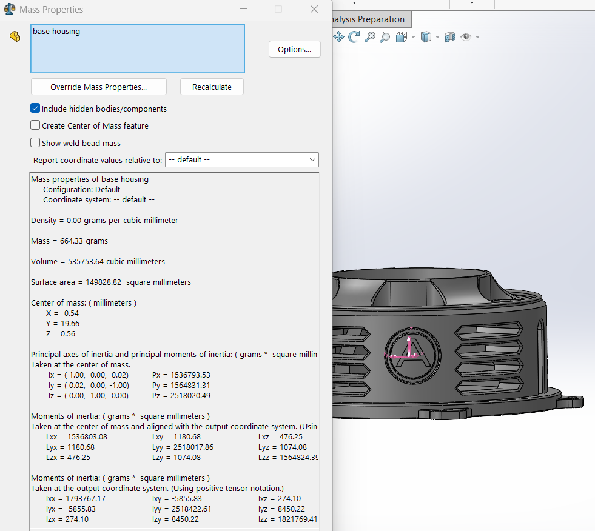

# Atlas V1 Material Properties

This document records the material data used for the preliminary engineering analysis of the 3D-printed Atlas V1 components.

## Material Identification

| Item | Specification |
|---|---|
| Manufacturer | Anycubic |
| Material | PLA |
| Technical document | Anycubic PLA TDS |
| TDS version | 3.0 |
| SolidWorks model | Linear Elastic Isotropic |
| Intended use | Preliminary mass and structural analysis |

## Manufacturer-Provided Physical Properties

| Property | Test Method | Typical Value |
|---|---|---:|
| Density | ISO 1183 at 23°C | 1.24 g/cm³ |
| Melt index | ISO 1133 | 5.7 ± 0.67 g/10 min |
| Moisture content | ISO 787-2 | 0.26% |

## Manufacturer-Provided Mechanical Properties

| Property | Orientation | Test Method | Typical Value |
|---|---|---|---:|
| Tensile strength | X-Y | ISO 527 | 48 ± 5 MPa |
| Tensile strength | Z | ISO 527 | 28 ± 2.4 MPa |
| Young's modulus | X-Y | ISO 527 | 2534 ± 85 MPa |
| Elongation at break | X-Y | ISO 527 | 8 ± 1% |
| Bending strength | X-Y | ISO 178 | 90 ± 3 MPa |
| Bending modulus | X-Y | ISO 178 | 3360 ± 100 MPa |
| Izod impact strength | X-Y | ISO 179 | 22 ± 1 kJ/m² |

## Manufacturer-Provided Thermal Properties

| Property | Typical Value |
|---|---:|
| Glass-transition temperature | 61.2°C |
| Melting temperature | 166°C |
| Crystallization temperature | 114°C |
| Vicat softening temperature | 55°C |
| Heat-deflection temperature | 54°C at 0.45 MPa |

## Values Entered in SolidWorks

| SolidWorks Property | Entered Value | Source |
|---|---:|---|
| Elastic modulus | 2534 MPa | Anycubic TDS V3.0 |
| Mass density | 1240 kg/m³ | Anycubic TDS V3.0 |
| Tensile strength | 48 MPa | Anycubic TDS V3.0 |

## Properties Not Provided by Anycubic

The TDS does not provide:

- Poisson's ratio
- shear modulus
- yield strength
- compressive strength
- thermal expansion coefficient
- thermal conductivity
- specific heat

## Material Density Verification

The custom Anycubic PLA material was temporarily assigned to the Atlas V1 base housing to verify the entered density.

| Property | SolidWorks Result |
|---|---:|
| Assigned density | 1.24 g/cm³ |
| Model volume | 535,753.64 mm³ |
| Calculated solid-model mass | 664.33 g |

The calculated value agrees with the expected relationship between model volume and the manufacturer-provided density.

The SolidWorks result assumes that all modeled material regions are fully dense. Actual printed mass may be lower because slicer-generated infill is not represented in the CAD mass calculation. Bambu Studio estimates and physical measurements will therefore be recorded separately for load calculations and validation.

Any additional values required for simulation will be obtained from separately cited technical sources and clearly identified as engineering assumptions rather than manufacturer-provided properties.

## Analysis Limitations

The SolidWorks material model treats PLA as homogeneous and isotropic. FDM-printed components are anisotropic, and their performance depends on print orientation, layer adhesion, wall count, infill, temperature, moisture, and print quality.

Anycubic reports an X-Y tensile strength of 48 ± 5 MPa and a Z-direction tensile strength of 28 ± 2.4 MPa. Therefore, print orientation must be considered when interpreting simulation results.

The Anycubic TDS also states that its values are intended for comparison rather than final design specifications. The numerical analysis will therefore be treated as preliminary and will later be validated through physical testing.

## Reference

[Anycubic PLA Technical Data Sheet, Version 3.0](References/ANYCUBIC_TDS_PLA_V3.0.pdf)
