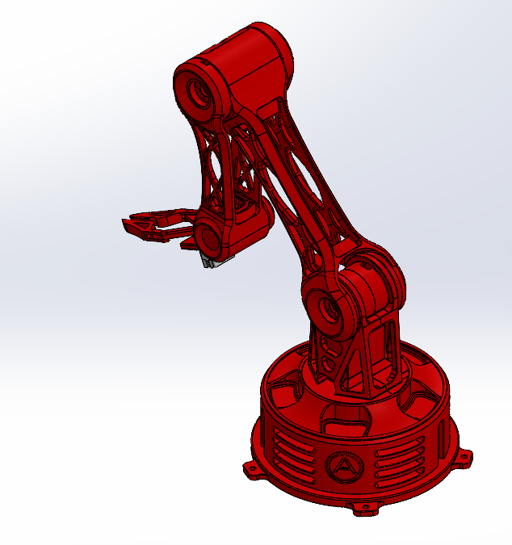
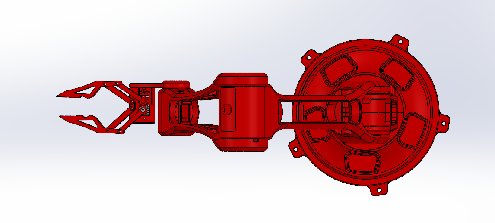

# Atlas V1 CAD

This folder contains the final mechanical design files for Project Atlas V1.

## Quick Access

- [`Final-Package/`](./Final-Package/) - final SolidWorks parts, assembly, and STL exports
- [`Slew-Bearing/`](./Slew-Bearing/) - printed base slew-bearing files
- [`Final-Assembly/`](./Final-Assembly/) - current CAD screenshots of the final assembly
- [`Reference_Components/`](./Reference_Components/) - servo reference geometry used in the CAD
- [`Final-CAD-Manifest.md`](./Final-CAD-Manifest.md) - file list for the final package

## Final Assembly Views

These are the most up-to-date CAD screenshots of the finished Atlas V1 assembly.

| View | Preview |
|---|---|
| Isometric |  |
| Side |  |
| Top |  |

## Final Mechanical Setup

| Subsystem | Final approach |
|---|---|
| Base | Printed housing with six-ball slew-bearing support |
| Shoulder / main joints | MG995-driven modular printed structure |
| Upper arm | Lightweight ribbed PLA link |
| Forearm | Revised printed forearm with more clearance and routing space |
| Wrist / gripper | MG90S-driven end-effector assembly |
| Controller | Separate printed enclosure for five potentiometers and a 16x2 LCD |
| Manufacturing | SolidWorks source files with STL exports for printed parts |

## Final CAD Package

The final CAD is stored in [`Final-Package/`](./Final-Package/). This is the version that matches the completed build and includes the arm links, shoulder mounts, base housing, wrist and gripper parts, bearing interfaces, and controller enclosure.

The separate [`Slew-Bearing/`](./Slew-Bearing/) folder contains the base bearing geometry. The finished bearing uses **six steel balls**.

I kept the original SolidWorks filenames because renaming referenced parts outside SolidWorks can break the assembly.

## Main Design Priorities

The final design focused on:

- joint clearance
- reducing printed mass without making the links too flexible
- access to servos and fasteners
- better base support
- cable-routing space
- parts that could be printed separately and replaced if needed
- keeping the mechanical style consistent across the arm

For the main redesigns and the problems that caused them, see [Design Evolution](../Design-Evolution/README.md).
