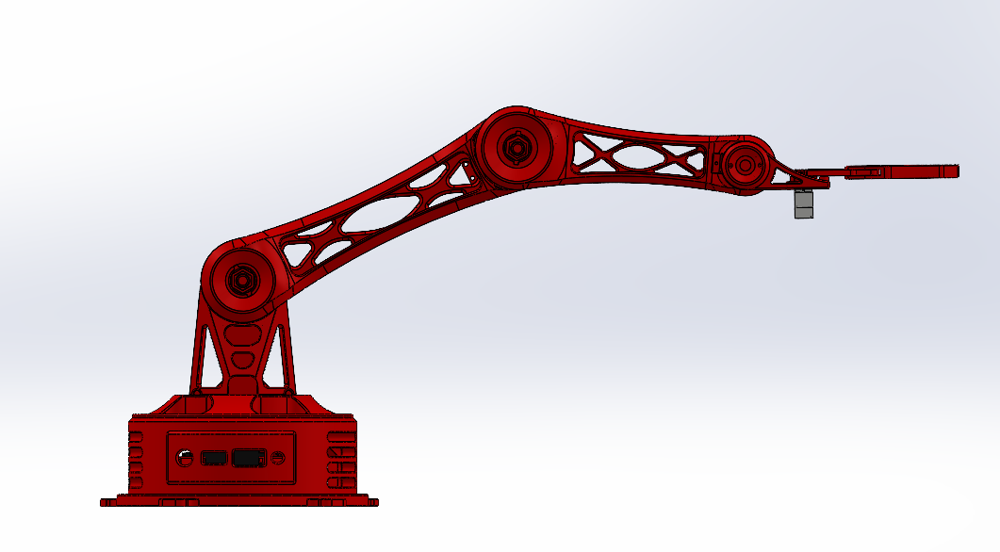

# Atlas V1 CAD

This folder contains the final mechanical design package for **Project Atlas V1**.

## Quick Access

- [`Final-Package/`](./Final-Package/) — authoritative final SolidWorks parts/assembly and printable STL exports
- [`Slew-Bearing/`](./Slew-Bearing/) — final printed slew-bearing geometry used at the base
- [`Final-Assembly/`](./Final-Assembly/) — quick-reference CAD screenshots
- [`Reference_Components/`](./Reference_Components/) — external/reference servo geometry
- [`Final-CAD-Manifest.md`](./Final-CAD-Manifest.md) — concise inventory of the final package

## Final Assembly Views

| View | Preview |
|---|---|
| Isometric |  |
| Side |  |
| Top |  |
| Extended |  |

## Final Mechanical Architecture

| Subsystem | Final approach |
|---|---|
| Base | Printed housing with six-ball slew-bearing support |
| Shoulder / main joints | MG995-driven modular printed structure |
| Upper arm | Lightweight ribbed PLA link |
| Forearm | Revised printed forearm with improved clearance and routing space |
| Wrist / gripper | MG90S-driven end-effector assembly |
| Controller | Separate printed enclosure for five potentiometers and 16×2 LCD |
| Manufacturing | Native SolidWorks files with STL exports for printable parts |

## Final CAD Package

The authoritative CAD is stored in [`Final-Package/`](./Final-Package/). It contains the completed mechanical assembly and the parts used for the finished build, including the arm links, shoulder mounts, base housing revisions, wrist/gripper components, bearing interfaces, and controller enclosure.

The separate [`Slew-Bearing/`](./Slew-Bearing/) directory contains the final base-bearing geometry. The physical build uses **six steel balls**.

Native filenames are intentionally preserved. Renaming referenced SolidWorks files outside SolidWorks can break assembly references.

## Design Priorities

The final geometry reflects lessons from the physical build, with emphasis on:

- joint clearance
- stiffness with reduced printed mass
- servo and fastener access
- bearing support
- cable-routing space
- printable split components
- replaceable/serviceable subassemblies
- consistent mechanical styling

For the reasoning behind the redesigns, see [Design Evolution](../Design-Evolution/README.md).
