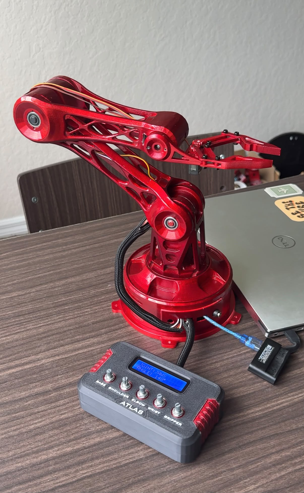

# Atlas V1 Design Evolution

Atlas V1 did not come from one finished CAD model. I went through several design, print, assembly, test, and redesign cycles before getting to the final version.

The main things I kept trying to improve were **joint clearance, stiffness, mass distribution, serviceability, cable routing, printability, and base stability**.

---

## Stage 1 - First Prototype

The first version proved that the basic servo-driven arm layout and gripper could work.

**Problems I found**

- bulky printed links
- limited joint clearance
- difficult servo access
- too much material in some parts
- inconsistent interfaces between components
- not enough room for cable routing

**What I changed:** I kept the general concept, but decided the structure needed a full redesign before I built the final version.

---

## Stage 2 - Enclosed Concept

I also tried an enclosed-shell version to hide the servos and wiring and make the arm look cleaner.

I did not continue with it because it added:

- more printed mass
- more supports
- more material
- harder assembly
- harder maintenance
- worse access to servos and fasteners

**What I changed:** I moved away from a closed shell and focused on an open, modular structure instead.

---

## Stage 3 - Lightweight Modular Redesign

The next version used open structural rails, internal ribs, modular servo housings, split printed parts, and better access around the joints.

This improved:

- printability
- component access
- cable routing
- assembly flexibility
- mass distribution
- overall appearance

**What I changed:** this became the main structure I used for the physical prototype.

---

## Stage 4 - Physical Test Revisions

Once I started assembling and testing the arm, I found problems that were much harder to notice in CAD.

The main ones were:

- the base tilting under the arm load
- forearm interference and restricted movement
- cable pinching
- servo-horn interference
- limited wrist and gripper clearance
- awkward access to some joints and fasteners

The biggest change was the base. I added a **printed slew bearing using six steel balls** so the rotating structure had its own mechanical support instead of relying mainly on the servo output shaft.

I also revised the forearm, servo interfaces, wiring space, and surrounding geometry after checking the real range of motion.

---

## Stage 5 - Completed Atlas V1

The final build uses:

- 3x MG995 servos for the larger arm joints
- 2x MG90S servos for the lighter end-effector functions
- printed structural links and modular housings
- a bearing-supported rotating base
- revised forearm and joint clearances
- managed cable routing
- a separate five-potentiometer controller enclosure
- a 16x2 LCD
- a metallic red painted finish

  

---

## Main Things I Learned

- Checking the full assembly matters more than checking parts one at a time.
- Weight farther from the shoulder has a much bigger effect on torque.
- Servo access, screw access, and cable routing need to be planned before printing.
- The servo shaft should not be the only structural support for a loaded rotating base.
- Physical prototypes expose tolerance, interference, stiffness, and routing problems that are easy to miss in CAD.
- A design can still look clean without adding a lot of extra material.

## Final Status

**Atlas V1 is complete as a functional physical prototype.**

I kept these earlier stages in the repo because they show how the project actually developed and why the final design looks the way it does.

For the final manufacturing and assembly details, see [Build Notes](../Documentation/Build-Notes.md).
